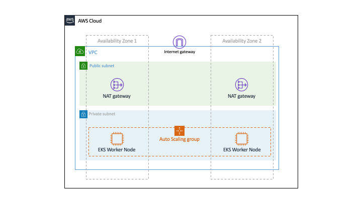

# AWS EKS Landing Zone

This repository contains reference CDK code to deploy an EKS cluster within a VPC with VPC Endpoints, Cluster Autoscaler, and other basic features preconfigured.

## Architecture



This implmentation will generate Cloudformation Stacks that provision infrastructure within your desired region. Below are the details of what is provisioned.

- 1 VPC
- 4-6 Subnets - 50% public and 50% private subnets spread across 2-3 availability zones
- 2-3 NAT Gateways deployed in the public subnets
- VPC Endpoints for ECR and Cloudwatch
- EKS Cluster
- EKS Worker Node Auto Scaling Group
- Cluster Autoscaler with corresponding IAM Policy

## Usage

Generate Cloudformation template for review:
```bash
cdk synth --profile <aws profile>
```

To deploy the stack simply run:
```bash
cdk deploy --profile <aws profile>
```
